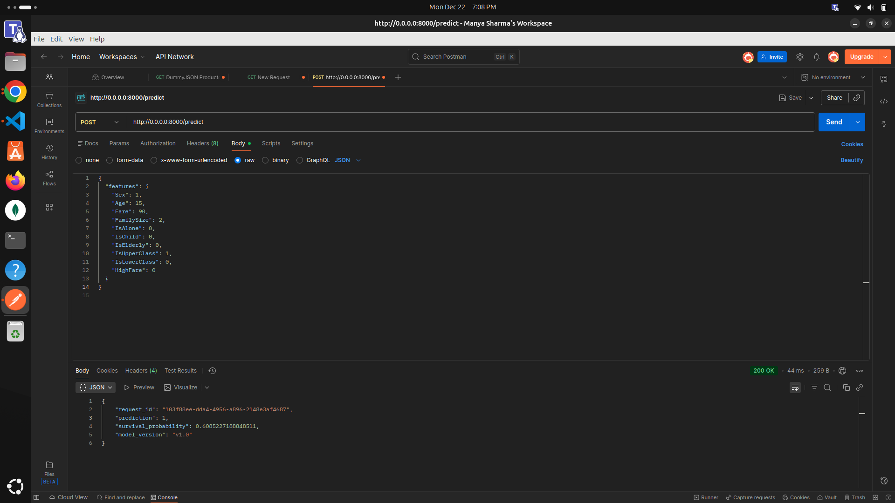
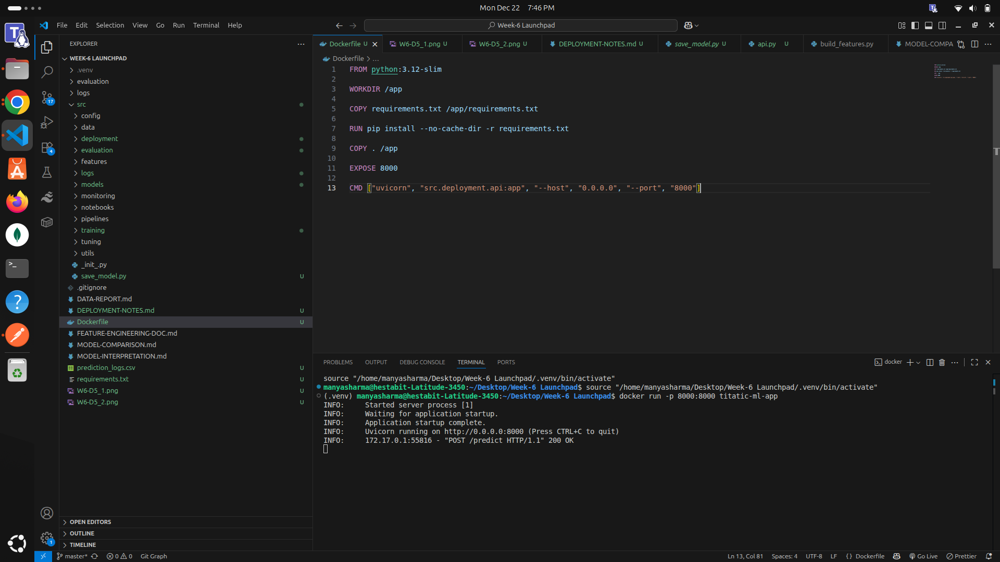

# Deployment Notes — Capstone Project (Day 5)

## Project Overview
This project demonstrates ML model deployment, monitoring, and basic MLOps concepts. It includes:
- Model serving using FastAPI
- Drift monitoring
- Prediction logging
- Versioned model loading
- Production-ready pipelines
- Dockerized deployment


## Folder Structure
```
src/
├── deployment/
│   └── api.py                
├── monitoring/
│   └── drift_checker.py      
├── models/
│   └── best_model.pkl
├── features/
│   ├── built_features.py
│   └── feature_list.json
prediction_logs.csv
Dockerfile
requirements.txt

```


## API (`api.py`)
**Endpoint:** `POST /predict`  

**Functionality:**
- Receives JSON input with feature values
- Validates input using Pydantic schema
- Loads the versioned model from `src/models/`
- Returns prediction
- Logs predictions with timestamp and request_id to `prediction_logs.csv`

**Sample Request:**
```json
POST /predict
{
  "Sex": 1,
  "Age": 15,
  "Fare" :90,
  "Family size":2,
  "IsAlone":0,
  "IsChild":0,
  "IsElderly":0,
  "IsUpperClass":1,
  "IsLOwerClass":0,
  "HighFare":0
}
```


**Drift Monitoring** (drift_checker.py)

Compares current predictions against training distribution using KS-test
Checks each numeric feature for drift
Reports as:
DRIFT if p-value < 0.05
NO_DRIFT otherwise
Skips non-numeric or missing columns


**Prediction Logging** (prediction_logs.csv)
Tracks every prediction with:
Request ID
Timestamp
Input features
Predicted output
Ensures traceability for monitoring and debugging


**Model Versioning**
Models are stored in src/models/
Versioning ensures:
Multiple model versions coexist
Easy rollback if a new version fails
Example:
v1_model.pkl
best_model.pkl


**Docker Deployment** (Dockerfile)
Uses Python base image
Copies code and installs dependencies from requirements.txt
Exposes FastAPI service via uvicorn


## Screenshots






